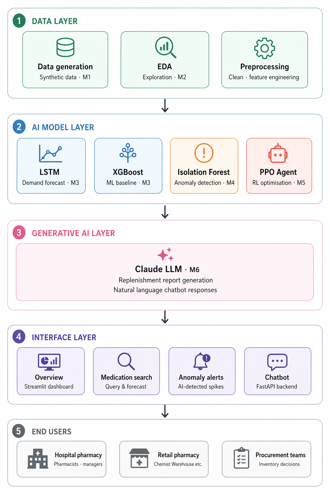

# MedStock-AU 💊

**AI-Powered Pharmaceutical Demand Forecasting and Inventory Optimisation System for Australian Hospital Pharmacies**

[](https://python.org)
[](https://streamlit.io)
[](https://tensorflow.org)
[](LICENSE)

---

## Overview

MedStock-AU is an end-to-end AI pipeline designed to address a critical gap in Australian hospital pharmacy management — the inability to anticipate demand spikes before they cause stockouts or costly overstock situations.

The system integrates multiple AI paradigms:
- **Time series forecasting** (LSTM) to predict future pharmaceutical demand
- **Unsupervised anomaly detection** (Isolation Forest) to flag unusual demand patterns
- **Reinforcement learning** (PPO) to optimise dynamic replenishment decisions
- **Large language models** (Claude API) to generate human-readable reports and power a conversational chatbot

### Target Users
- Hospital pharmacy managers — RPA, Westmead, St Vincent's, Prince of Wales
- Retail pharmacy chains — Chemist Warehouse, Priceline, TerryWhite Chemmart
- Procurement and inventory teams across the Sydney metropolitan network

---

## System Architecture



---

## Key Features

| Feature | Technology | Description |
|---------|-----------|-------------|
| Demand forecasting | LSTM + XGBoost + Prophet | 3-model comparison with RMSE, MAE, MAPE evaluation |
| Anomaly detection | Isolation Forest | Per location-medication model, 4.04% anomaly rate |
| Inventory optimisation | PPO (stable-baselines3) | RL agent outperforms rule-based and random policies |
| Report generation | Claude API (claude-sonnet-4-5) | Auto-generated human-readable replenishment reports |
| Conversational interface | FastAPI + Claude API | Natural language stock and forecast queries |
| Dashboard | Streamlit (5 pages) | Korean butter aesthetic, DM Sans, rose-pink palette |

---

## Dataset

MedStock-AU uses a **synthetic dataset** generated to simulate realistic pharmacy demand patterns, in compliance with Australian privacy regulations (Privacy Act 1988, My Health Records Act 2012).

| Parameter | Value |
|-----------|-------|
| Time period | January 2022 – December 2024 |
| Frequency | Daily |
| Locations | 8 (4 hospital + 4 retail pharmacies) |
| Medications | 15 (PBS-listed, commonly dispensed) |
| Total records | 105,216 |
| Region | Sydney, NSW, Australia |

### Locations
**Hospital pharmacies:** RPA Hospital, Westmead Hospital, St Vincent's Hospital, Prince of Wales Hospital

**Retail pharmacies:** Chemist Warehouse Epping, Chemist Warehouse Sydney CBD, Priceline Pharmacy Pitt Street, TerryWhite Chemmart Parramatta

### Medications
Paracetamol, Ibuprofen, Amoxicillin, Metformin, Atorvastatin, Omeprazole, Salbutamol, Pantoprazole, Codeine, Ondansetron, Enoxaparin, Dexamethasone, Sertraline, Rosuvastatin, Cetirizine

---

## Project Structure

MedStock-AU/
├── data/
│   ├── raw/                          # Synthetic raw demand data
│   └── processed/                    # Cleaned and feature-engineered data
├── notebooks/
│   ├── 01_data_generation.ipynb      # Synthetic data generation
│   ├── 02_eda.ipynb                  # Exploratory data analysis
│   ├── 03_forecasting.ipynb          # Prophet → XGBoost → LSTM comparison
│   ├── 04_anomaly_detection.ipynb    # Isolation Forest
│   ├── 05_reinforcement_learning.ipynb  # PPO inventory optimisation
│   └── 06_llm_chatbot.ipynb          # LLM integration + FastAPI
├── app/
│   ├── main.py                       # Streamlit entry point
│   ├── styles.css                    # Custom UI styling
│   └── pages/
│       ├── 01_overview.py            # Network dashboard
│       ├── 02_medication_search.py   # Drug query & forecast
│       ├── 03_anomaly_alerts.py      # Anomaly detection view
│       ├── 04_reorder_report.py      # LLM report generation
│       └── 05_chatbot.py             # Conversational interface
├── api/
│   └── main.py                       # FastAPI backend
├── src/
│   └── models/                       # Saved LSTM and PPO models
├── reports/
│   └── images/                       # Architecture diagram and charts
├── .env                              # API keys (not committed)
├── .gitignore
├── requirements.txt
└── README.md

---

## Model Performance

### Demand Forecasting — RPA Hospital: Paracetamol

| Model | Type | RMSE | MAE | MAPE |
|-------|------|------|-----|------|
| Naive forecast | Baseline | 62.92 | 43.23 | 13.94% |
| Prophet | Statistical | 244.45 | 199.24 | 67.97% |
| XGBoost | Machine learning | 62.49 | 41.21 | 12.38% |
| **LSTM** | **Deep learning** | **56.70** | **43.93** | **13.78%** |

LSTM achieves the lowest RMSE by capturing non-linear temporal dependencies across a 30-day sliding window. Prophet underperforms due to irregular outbreak spikes that violate its smooth seasonality assumption.

### Anomaly Detection

| Metric | Value |
|--------|-------|
| Algorithm | Isolation Forest (per location-medication) |
| Contamination | 0.02 |
| Total anomalies | 4,228 |
| Anomaly rate | 4.04% |
| RPA Paracetamol rate | 4.5% |

### Reinforcement Learning — Inventory Optimisation

| Policy | Total reward | Total stockout | Service level |
|--------|-------------|----------------|---------------|
| **PPO agent** | **-1,450,198** | **144,879** | **49.1%** |
| Rule-based | -1,553,586 | 155,229 | 45.5% |
| Random | -1,545,183 | 154,329 | 45.8% |

The PPO agent reduces cumulative stockout by ~10,000 units over 3 years compared to rule-based ordering.

---

## Installation

### Prerequisites
- Python 3.11
- pip

### Setup

```bash
# Clone repository
git clone https://github.com/your-username/MedStock-AU.git
cd MedStock-AU

# Install dependencies
pip install -r requirements.txt

# Set up environment variables
cp .env.example .env
# Add your Anthropic API key to .env:
# ANTHROPIC_API_KEY=sk-ant-...
```

### Run Streamlit Dashboard

```bash
streamlit run app/main.py
```

### Run FastAPI Backend

```bash
cd api && uvicorn main:app --reload --port 8000
```

API documentation available at: `http://localhost:8000/docs`

---

## API Endpoints

| Method | Endpoint | Description |
|--------|---------|-------------|
| GET | `/` | API info |
| GET | `/health` | Health check |
| POST | `/stock` | Current stock query |
| POST | `/forecast` | 7-day demand forecast |
| GET | `/anomalies` | Recent anomaly alerts |
| GET | `/report` | Location summary |
| POST | `/chat` | Conversational chatbot |

### Example — Stock Query

```bash
curl -X POST http://localhost:8000/stock \
  -H "Content-Type: application/json" \
  -d '{"location": "RPA", "medication": "Paracetamol"}'
```

```json
{
  "location": "RPA Hospital Pharmacy",
  "medication": "Paracetamol",
  "stock_units": 80,
  "reorder_point": 300,
  "avg_demand_7d": 266.3,
  "status": "CRITICAL",
  "days_remaining": 0.3
}
```

---

## Responsible AI

MedStock-AU is designed with responsible AI principles:

| Principle | Implementation |
|-----------|---------------|
| **Transparency** | Chatbot clearly identifies as AI; reports labelled "Powered by Claude AI" |
| **Scope limitation** | LLM strictly constrained to inventory-related queries only |
| **Human oversight** | All AI recommendations require human pharmacist approval before execution |
| **Privacy compliance** | Synthetic data only; compliant with Privacy Act 1988 |
| **Hallucination mitigation** | LLM inputs are structured JSON data, not free-form generation |

---

## Limitations

- Synthetic data cannot fully replicate real-world complexity (PBS policy changes, drug substitution effects)
- RL service level of 49% reflects a structural constraint (max order 250 units < avg daily demand 263 units) rather than model failure
- LLM responses may vary; outputs should be reviewed by qualified pharmacy staff
- Currently limited to Sydney metropolitan area; generalisation to other regions requires retraining

---

## Tech Stack

| Category | Technology |
|----------|-----------|
| Language | Python 3.11 |
| Deep learning | TensorFlow 2.16, Keras |
| Machine learning | XGBoost, scikit-learn |
| Reinforcement learning | stable-baselines3, Gymnasium |
| Statistical forecasting | Prophet |
| LLM | Anthropic Claude API |
| Dashboard | Streamlit |
| API backend | FastAPI, Uvicorn |
| Visualisation | Plotly, Matplotlib, Seaborn |
| Data | Pandas, NumPy |

---

## Author

**Amanda**
Master's student · Data Science
Sydney, Australia

---

*Built as a portfolio project demonstrating end-to-end AI system design,
from synthetic data generation through to production-ready deployment.*